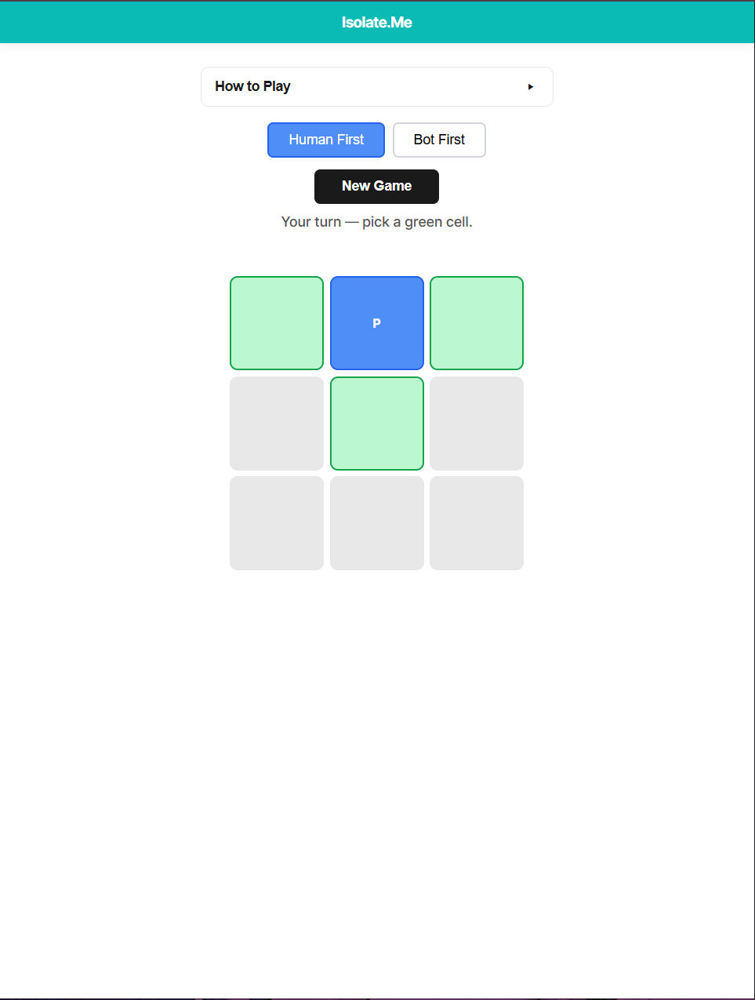

# Isolation Game (Web & AI)

Minimalistlik kahe mängija strateegiamäng **Isolation**, kus inimene mängib Minimax-algoritmil põhineva tehisintellekti (boti) vastu. Projekt on arendatud Reacti ja Vite baasil tehisintellekti agentide abil.

---

## 📸 Ekraanipilt

<!-- Aseta ekraanipilt projekti kausta: docs/screenshot.png -->

---

## 🎮 Mängureeglid

Mäng põhineb aine tehisintellekti 1. koduülesande (`kodu1.js`) loogikal[cite: 1, 2]:

1. Mängulaud on **3x3** ruudustik[cite: 2].
2. Mängus on **üks ühine nupp**, mis alustab ruudustiku positsioonilt **2** (indeks 1)[cite: 2].
3. Algusruut söestub koheselt mängu käivitumisel[cite: 2].
4. Mängija ja bot teevad käike kordamööda, liigutades ühist nuppu ühe sammu võrra neljas suunas (**üles, alla, vasakule, paremale**)[cite: 2].
5. Iga ruut, kuhu astutakse, söestub ja muutub jäädavalt läbipääsmatuks[cite: 2].
6. Mängija, kelle käigukorral pole enam ühtegi vaba naaberruutu, **kaotab mängu**[cite: 2].

---

## 🛠 Tehnoloogiapino

- **Käivitus ja kooste:** Vite[cite: 1, 3]
- **Kasutajaliides:** React (Vanilla JS / JSX, ilma väliste UI teekideta)[cite: 1, 3]
- **Kujundus:** Puhas CSS (CSS Grid, CSS Flexbox, modernne reset, Tiffany Blue bränding)[cite: 1, 3]
- **AI mootor:** Minimax algoritm puhtas JavaScript moodulis (`src/utils/minimax.js`)[cite: 1, 3]
- **Versioonihaldus:** Git (Conventional Commits)[cite: 1, 3]

---

## 📁 Projekti struktuur

Tehis2/
├── index.html # HTML pealeht
├── GEMINI.md # Agendi arendusreeglid ja juhised
├── package.json # Projekti skriptid ja sõltuvused
├── docs/
│ └── screenshot.png # Mängu ekraanipilt (paiguta fail siia kausta)
└── src/
├── main.jsx # Reacti sisenemispunkt
├── App.jsx # Rakenduse peakoostaja
├── index.css # Lähtestus, CSS Grid ja kujundusstiilid
├── components/
│ ├── Header.jsx # Kleepuv päis Tiffany Blue stiilis
│ ├── Rules.jsx # Reeglite rippmenüü
│ ├── Board.jsx # 3x3 mänguväli ja ruutude olekud
│ └── Game.jsx # Mängu olekumasin ja käikude juhtimine
└── utils/
└── minimax.js # Puhas Minimax otsustusloogika ja tehisintellekt

---

## 🐛 Teadaolevad vead ja agendi omapärad (Known Quirks / Bugs)

- **Võitja tähistus (AI iseseisev lahendus):** Mängu lõppseisus otsustas tehisintellekti agent algselt kavandatud lihtsa nupumärgenduse asemel lisada võidutrofee ikooni (`🏆 P` või `🏆 B`). Lahendus osutus visuaalselt selgeks ja jäeti rakendusse püsima.
- **Reeglite rippmenüü noole suund:** Komponendis `Rules.jsx` esineb väike visuaalne vastuolu — menüü avamisel/sulgemisel ei kattu teksti indikaatori noole suund (▲ / ▼) alati loogilise avatud/suletud olekuga (vajab nupu sildi ümberpööramist).

---

## 🚀 Käivitamine lokaalselt

### Eeltingimused

- Node.js (versioon 18 või uuem)
- npm

### Paigaldus ja käivitus

1. Klooni repositoorium ja liigu kausta:
   cd Tehis2

2. Paigalda sõltuvused:
   npm install[cite: 1, 3]

3. Käivita arendusserver:
   npm run dev[cite: 1, 3]
   Ava brauseris kuvatud aadress (tavaliselt http://localhost:5173).

4. Koosta tootmisversioon (Build):
   npm run build[cite: 1, 3]
